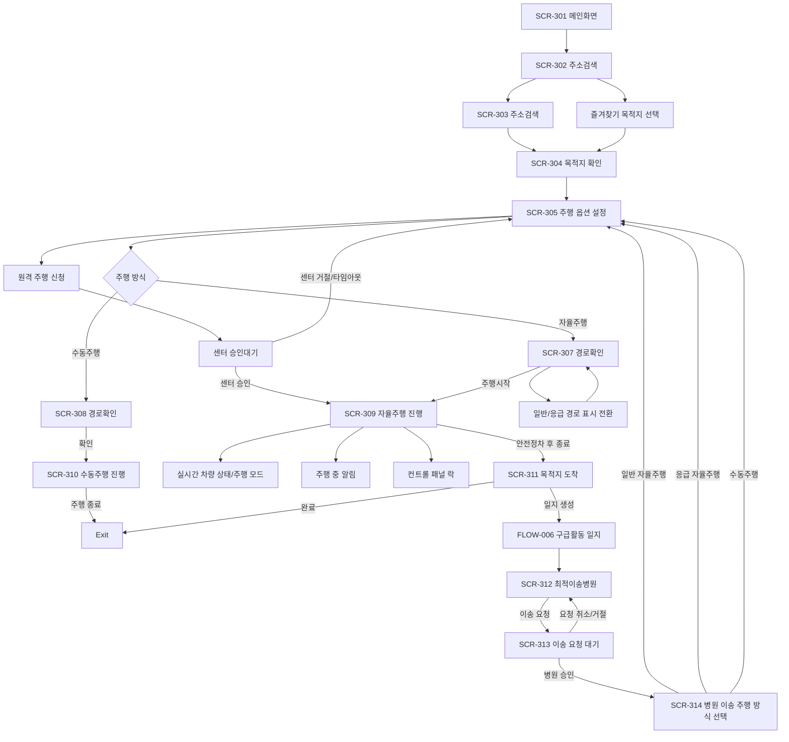

# Information Architecture

## 1. IA Summary

앱의 화면 계층, 진입점, 내비게이션, 메뉴 구조를 정리한다.

V1.1에서는 자율주행 생성 플로우의 기본 골격은 유지하되, 차량 선택 프로세스를 제거하고 주행 옵션/경로 확인/주행 진행 화면에 원격주행, 경로 전환, 실시간 상태, 알림, 제어 잠금 구조를 추가한다.

## 2. Screen Inventory

| Screen ID | 화면명 | Figma Node | 상위 영역 | 주요 목적 | V1.1 영향 | 상태 |
| --- | --- | --- | --- | --- | --- | --- |
| SCR-301 | 메인화면 | `423:3782` | 홈/메인 | 목적지 검색 또는 스케줄 시작 진입 | 유지 | Observed |
| SCR-302 | 주소검색 | `423:3862` | FLOW-003 | 최근 검색/즐겨찾기 기반 주소 검색 | 즐겨찾기는 항상 즐겨찾기 목적지 선택 기능으로 유지한다. 단, 원격재배치 버튼을 통해 진입한 경우 선택 후 주행 상태를 원격재배치중으로 표기한다. | Changed |
| SCR-303 | 주소검색 | `423:3885` | FLOW-003 | 검색어 기반 주소 후보 선택 | 검색 결과 선택은 일반 목적지 선택 기능으로 유지한다. 단, 원격재배치 버튼을 통해 진입한 경우 선택 후 주행 상태를 원격재배치중으로 표기한다. | Changed |
| SCR-304 | 목적지 확인 | `423:3908` | FLOW-003 | 지도에서 선택 목적지 확인 | 유지 | Observed |
| SCR-305 | 주행 옵션 설정 | `423:3919` | FLOW-003 | 주행 방식, 출동 유형 설정 | 차량 선택 제거, EMS->센터 원격 주행 신청 추가. 주행 방식과 출동 유형은 모두 필수 선택이며 기본값 없음 | Changed |
| SCR-306 | 운행 차량 선택 | `424:6024` | FLOW-003 | 운행 차량 선택 셀렉트박스, 차량 번호와 차량 상태 확인 | 운행 앰뷸런스 1대 정책으로 V1.1 플로우에서 제거 | Deprecated |
| SCR-307 | 경로확인 | `423:3946` | FLOW-003 | 자율주행 경로 확인, 재요청/주행시작 | 응급 자율주행 시 일반/응급 경로 표시 전환 단추 추가 | Changed |
| SCR-308 | 경로확인 | `423:5958` | FLOW-003 | 수동주행 경로 정보 미제공 안내 | 실제 경로 생성이 아니므로 CTA는 `확인`으로 처리 | Changed |
| SCR-309 | 자율주행 진행 | `423:3961` | FLOW-003 | 자율주행 ETA 표시, 일시 중지/주행 종료 | 실시간 차량 상태, 주행 모드, 긴급 경로 알림, 수동 전환 알림, 원격주행 요청 알림, 컨트롤 패널 락 추가 | Changed |
| SCR-310 | 수동주행 진행 | `423:5989` | FLOW-003 | 수동주행 중 주행 종료 | 자율주행 중 수동 전환 후속 상태와 연결 | Changed |
| SCR-311 | 목적지 도착 알트 | `423:3975` | FLOW-003 | 자율주행 목적지 도착 후 완료/목적지 추가/일지 생성 분기 | 자율주행 화면 위 플로팅 알트로 표시, 수동주행 종료에는 표시하지 않음 | Changed |
| SCR-312 | 최적이송병원 | `423:4019` | FLOW-003 | AI API 추천 결과 표시 및 병원 이송요청 | 유지 | Observed |
| SCR-313 | 이송 요청 대기 | `423:4065` | FLOW-003 | 병원 이송요청 후 승인 대기/요청 취소 상태 | 유지 | Observed |
| SCR-314 | 병원 이송 주행 방식 선택 | `423:4077` | FLOW-003 | 병원 승인 후 일반 자율주행/응급 자율주행/수동주행 선택 | 선택 후 차량 선택 없이 SCR-305 또는 경로 생성 흐름으로 재진입 | Changed |
| SCR-601 | 구급활동 일지 | `423:4101` | FLOW-006 | 응급 출동 후 구급활동 기록 | 유지 | Observed |
| SCR-602 | 구급일지 종료 확인 | `423:4251` | FLOW-006 | 일지 미작성 종료 확인 | 유지 | Observed |

## 2.1 V1.1 Figma Wireframe Reference

V1.1 와이어프레임은 Figma `EMS 키오스크 V1.1` 페이지(`1569:2392`)에 작성한다. 기존 `423:*` 노드는 V1.0 관찰 근거로 유지하고, V1.1 변경 화면은 아래 와이어프레임 노드를 기준으로 검토한다.

| Screen / State | V1.1 Wireframe Node | 비고 |
| --- | --- | --- |
| SCR-302 | `1580:72` | 즐겨찾기/원격재배치 진입 |
| SCR-303 | `1580:93` | 검색 결과/원격재배치 진입 |
| SCR-305 | `1580:117` | 단일 차량 상태, 원격 주행 신청 |
| SCR-306 | - | V1.1 폐기 |
| SCR-307 | `1580:143` | 응급/일반 경로 표시 전환 |
| SCR-309 기본 | `1580:166` | 실시간 차량 상태 패널 |
| SCR-309 긴급 경로 알림 | `1580:190` | 긴급 경로 진입 예정 |
| SCR-309 수동 전환 알림 | `1580:210` | 수동주행중 알림/재요청 |
| SCR-309 센터 원격 요청 | `1580:230` | 승인/거절 알림 |
| SCR-309 안전 정차/경로 갱신 | `1580:250` | 컨트롤 패널 락, 경로 갱신 |
| SCR-312 | `1581:70` | 추천병원 목록, 이송 요청 |
| SCR-313 | `1580:270` | 승인 대기, 거절 토스트, 재요청 |

## 3. V1.1 IA Changes

| IA Change ID | 구조 변경 | 적용 위치 | 설명 | 상태 |
| --- | --- | --- | --- | --- |
| IA-CHG-1.1-001 | 차량 선택 프로세스 제거 | SCR-305, SCR-306 | 운행 앰뷸런스가 1대로 변경되어 사용자가 차량을 선택하는 화면/단계를 제거한다. 차량상태 조회는 백그라운드 또는 상태 영역에서 처리한다. | Draft |
| IA-CHG-1.1-002 | 원격 주행 신청 진입점 추가 | SCR-305 | 원격 주행 신청은 SCR-305 안의 주행 옵션이며 EMS->센터 신청만 제공한다. | Confirmed |
| IA-CHG-1.1-003 | 응급/일반 경로 표시 전환 | SCR-307 | 응급 자율주행 경로 확인 시 카카오맵 위에서 응급 경로와 일반 경로 표시를 단추 메뉴로 전환한다. | Draft |
| IA-CHG-1.1-004 | 실시간 차량 상태 영역 추가 | SCR-309 | 차량속도, 차량위치, 차량방향(heading), 자율주행모드를 상시 확인 가능한 상태 영역으로 배치한다. | Confirmed |
| IA-CHG-1.1-005 | 주행 중 알림 레이어 추가 | SCR-309 | 긴급 경로 진입 예정, 수동 전환, 센터 원격주행 요청 알림을 진행 화면 위에 표시한다. | Draft |
| IA-CHG-1.1-006 | 컨트롤 패널 락 상태 추가 | SCR-309 | 안전정차대기 등 제어 불가 상태에서 주행 제어 패널을 잠그고 상태를 표시한다. | Draft |
| IA-CHG-1.1-007 | 원격재배치 진입 상태 추가 | SCR-302, SCR-303, SCR-309 | 즐겨찾기는 항상 즐겨찾기 목적지 선택 기능으로 유지한다. 원격재배치 버튼을 통해 경로 검색에 진입한 경우 목적지 선택 후 주행 상태를 원격재배치중으로 표기한다. | Draft |
| IA-CHG-1.1-008 | 경로 이탈/갱신 상태 표시 | SCR-309 | 차량이 경로를 이탈하고 센터가 경로를 재생성하는 동안 경로 갱신 상태를 표시할 수 있어야 한다. | Draft |

## 4. Navigation Model

| From | Trigger | To | 조건 | 비고 |
| --- | --- | --- | --- | --- |
| SCR-301 | 목적지 검색 선택 | SCR-302 | 직접 주소 입력 시작 | Observed |
| SCR-301 | 스케줄 시작 | SCR-305 | 스케줄은 항상 목적지를 저장하고 있으므로 주행 옵션으로 바로 이동 | Confirmed |
| SCR-302 | 검색어 입력 | SCR-303 | 주소 후보 조회 | Observed |
| SCR-302 | 즐겨찾기 선택 | SCR-304 | 즐겨찾기 목적지 선택. 원격재배치 버튼으로 진입한 경우 후속 주행 상태를 원격재배치중으로 표기 | Changed |
| SCR-303 | 주소 선택 | SCR-304 | 목적지 지도 확인 | Observed |
| SCR-304 | 경로 생성 | SCR-305 | 주행 상세 설정 필요 | Observed |
| SCR-305 | 경로 생성 | SCR-307/SCR-308 | 주행 방식에 따라 경로확인 화면 분기, 차량 선택 단계는 생략 | Changed |
| SCR-305 | 원격 주행 신청 | 승인대기 상태 | EMS->센터 원격주행 요청. 센터->EMS 신청은 SCR-305 옵션이 아님 | New |
| Center Event | 원격주행 요청 수신 | Global Alert | 화면 위치와 무관한 센터->EMS 원격주행 요청 글로벌 알림 | New |
| SCR-307 | 경로 표시 단추 선택 | SCR-307 | 응급 자율주행에서 일반/응급 경로 표시만 전환 | New |
| SCR-307 | 재요청 | 경로 재생성 | 옵션 선택 단계로 돌아가지 않고 경로만 다시 생성 | Confirmed |
| SCR-307/SCR-308 | 주행시작/확인 | SCR-309/SCR-310 | 자율주행은 경로 확인 후 주행시작, 수동주행은 실제 경로 생성 없이 확인 후 진행 화면 진입 | Confirmed |
| SCR-309 | 일시 중지 | 안전정차대기 후 정차 상태 | 차량이 정차모드로 바뀌고 완전 정차 전까지 화면 프리즈. 정차 후 `운행 재시작` 버튼 표시 | Changed |
| SCR-309 | 주행 종료 | 안전정차대기 후 SCR-311 알트 | 안전정차 완료 후 자율주행 화면 위 도착/종료 알트 표시 | Changed |
| Vehicle Event | 운전대/페달 조작 | SCR-309 수동 전환 알림 | 자율주행 중 운전대/페달 조작 시 즉시 수동 모드 전환. SCR-310은 원래 수동주행 화면이므로 별도 수동 전환 알림 대상이 아님 | New |
| SCR-309 | 수동 전환 알림에서 주행 종료 | SCR-311 알트 또는 토스트 | 정차 시 도착/종료 알트, 미정차 시 토스트 | New |
| SCR-309 | 수동 전환 알림에서 자율주행 재요청 | 경로 재산정 | 정차 시 이벤트 유지 후 코스 재산정, 미정차 시 토스트 | New |
| Center Event | 긴급 경로 진입 예정 | SCR-309 알림 | NN초 전 알림 시간은 협의 필요 | New |
| Center Event | 경로 이탈/경로 갱신 | SCR-309 | 경로 갱신중 및 갱신 경로 반영 | New |
| SCR-310 | 주행 종료 | Exit | 수동주행 화면에서 직접 완료 처리, SCR-311 알트 미표시 | Confirmed |
| SCR-311 | 완료 | Exit | 일반 출동 완료 | Confirmed |
| SCR-311 | 일지 생성 | FLOW-006 | 응급 출동은 구급활동 일지 플로우 진입 | Confirmed |
| SCR-601 | 이송 병원 추천 선택 | SCR-312 | 구급활동 일지 화면 내 `이송 병원 추천` 선택 후 AI API 결과 표시 | Confirmed |
| SCR-312 | 병원 이송요청 | SCR-313 | 추천 병원으로 이송 요청 후 승인 대기 상태 표시 | Observed |
| SCR-313 | 병원 승인 | SCR-314 | 병원 별도 기기에서 승인 | Confirmed |
| SCR-313 | 요청 취소 | SCR-312 | 이송 요청 취소 후 추천 목록으로 복귀 | Observed |
| SCR-313 | 병원 이송요청 거절 | SCR-312 | `00병원에서 이송요청을 거절하였습니다.` 토스트 표시 후 해당 병원 액션을 재요청 버튼으로 변경 | Confirmed |
| SCR-314 | 일반 자율주행 선택 | SCR-305 | 선택한 병원을 목적지로 자율주행 생성 루프 재진입, 차량 선택 생략 | Changed |
| SCR-314 | 응급 자율주행 선택 | SCR-305 | 선택한 병원을 목적지로 자율주행 생성 루프 재진입, 차량 선택 생략 | Changed |
| SCR-314 | 수동주행 선택 | SCR-305 | 선택한 병원을 목적지로 수동주행 생성 루프 재진입, 차량 선택 생략 | Changed |

## 5. Menu / Tab Structure

| 레벨 | 메뉴/탭/액션 | 연결 화면 | 표시 조건 | 상태 |
| --- | --- | --- | --- | --- |
| 1 | 홈/메인 | SCR-301 | 앱 진입 후 메인 화면 | Observed |
| 2 | 목적지 검색 | SCR-302 ~ SCR-304 | 목적지 검색 또는 스케줄 시작 후 진입 | Observed |
| 2 | 주행 옵션 설정 | SCR-305 | 목적지 확인 후 진입 | Changed |
| 3 | 원격 주행 신청 | SCR-305 | 주행 옵션 선택 시 표시 | New |
| 3 | 즐겨찾기 기반 목적지 선택 | SCR-302, SCR-303 | 즐겨찾기 목적지 선택. 원격재배치 버튼 진입 여부에 따라 후속 주행 상태만 달라짐 | Changed |
| 3 | 일반/응급 경로 표시 전환 | SCR-307 | 응급 자율주행 경로 확인 시 카카오맵 위 표시 | New |
| 3 | 주행 상태 패널 | SCR-309 | 자율주행 진행 중 상시 표시 | New |
| 3 | 주행 중 알림 | SCR-309 | 긴급 경로, 수동 전환, 원격주행 요청 이벤트 수신 시 표시 | New |
| 3 | 컨트롤 패널 락 | SCR-309 | 안전정차대기 또는 제어 제한 상태 | New |
| 2 | 구급활동 일지 | SCR-601, SCR-602 | 응급 출동 후 일지 생성 | Observed |
| 2 | 최적이송병원 추천 | SCR-312 ~ SCR-314 | 구급활동 일지 후 병원 추천/이송 요청 | Confirmed |

## 6. Screen Hierarchy

## 7. Entry and Exit Points

| ID | 구분 | 진입/이탈 지점 | 조건 | 관련 화면/상태 |
| --- | --- | --- | --- | --- |
| IA-ENTRY-301 | Entry | 목적지 검색 | 사용자가 메인 화면에서 출동 주소 검색 영역 선택 | SCR-301 |
| IA-ENTRY-302 | Entry | 스케줄 시작 | 사용자가 메인 화면 스케줄 카드에서 `스케줄 시작` 선택. 스케줄은 항상 목적지를 저장하고 있음 | SCR-301 |
| IA-ENTRY-303 | Event Entry | 센터 원격주행 요청 | 센터가 EMS에 원격주행 요청 알림 송신 | SCR-309, STATE-426 |
| IA-ENTRY-304 | Event Entry | 수동 전환 알림 | 운전대/페달 조작으로 수동 모드 전환 | SCR-309, STATE-502 |
| IA-ENTRY-305 | Event Entry | 긴급 경로 진입 알림 | 센터가 긴급 경로 진입 예정 이벤트 송신 | SCR-309, STATE-501 |
| IA-ENTRY-306 | Event Entry | 경로 이탈/갱신 | 차량 경로 이탈 및 센터 경로 재생성 이벤트 | SCR-309, STATE-483~STATE-485 |
| IA-EXIT-301 | Exit | 일반 출동 완료 | 목적지 도착에서 `완료` 선택 | SCR-311 |
| IA-EXIT-302 | Exit | 구급활동 일지 플로우 진입 | 응급 출동 운행 종료 후 `일지 생성` 선택 | FLOW-006 |
| IA-EXIT-303 | Exit | 수동 전환 후 주행 종료 | 자율주행 중 수동 전환 알림에서 정차 상태로 주행 종료 선택 | SCR-309 |
| IA-LOOP-304 | Loop | 일시정지 후 운행 재시작 | `운행 재시작` 선택 후 확인 알트에서 확인 선택 | SCR-309 -> 기존 경로 자율주행 재개 |
| IA-LOOP-301 | Loop | 병원 이송 주행 생성 재진입 | 병원 이송요청 승인 후 주행 방식 선택 | SCR-314 -> SCR-305 |
| IA-LOOP-302 | Loop | 수동 전환 후 자율주행 재요청 | 정차 상태에서 자율주행 재요청 선택 | SCR-309 -> 경로 재산정 |
| IA-LOOP-303 | Loop | 경로 이탈 후 경로 갱신 | 센터가 경로 재생성 후 ADS/EMS에 갱신 경로 전달 | SCR-309 |

## 8. V1.1 Surface Map

| Surface ID | UI Surface | 위치 | 역할 | 관련 상태 |
| --- | --- | --- | --- | --- |
| SURF-401 | 원격 주행 신청 액션 | SCR-305 | EMS->센터 원격주행 요청 시작 | STATE-421~STATE-425 |
| SURF-402 | 센터 원격주행 요청 알림 | Global Alert | 화면 위치와 무관하게 표시되는 센터->EMS 원격주행 요청 승인/거절 | STATE-426~STATE-428 |
| SURF-403 | 경로 표시 전환 단추 | SCR-307 지도 위 | 응급/일반 경로 표시 전환 | STATE-481, STATE-482 |
| SURF-404 | 실시간 차량 상태 패널 | SCR-309 | 차량속도, 차량위치, heading, 자율주행모드 표시 | STATE-401 |
| SURF-405 | 긴급 경로 진입 알림 | SCR-309 | 진입 예정 긴급경로 유형 알림 | STATE-501 |
| SURF-406 | 수동 전환 알림 | SCR-309 | 수동주행중 상태와 후속 버튼 표시 | STATE-402, STATE-502 |
| SURF-407 | 컨트롤 패널 락 | SCR-309 | 안전 정차 전 제어 제한 | STATE-405, STATE-462 |
| SURF-408 | 경로 갱신 상태 | SCR-309 지도/상태 영역 | 경로 이탈, 갱신중, 갱신 경로 반영 표시 | STATE-483~STATE-485 |
| SURF-409 | 즐겨찾기 버튼 | SCR-302, SCR-303 하단 | 즐겨찾기 목적지 선택. 원격재배치 버튼 진입 시 후속 주행 상태를 원격재배치중으로 표기 | STATE-404 |

## 9. Deprecated / Removed Structure

| ID | 제거/비활성 구조 | 기존 위치 | V1.1 처리 | 영향 |
| --- | --- | --- | --- | --- |
| IA-DEP-301 | 운행 차량 선택 화면 | SCR-306 | V1.1 기본 플로우에서 제거 | Canonical IA, Feature Spec, Traceability 반영 완료 |
| IA-DEP-302 | 주행 옵션 내 차량 선택 필드 | SCR-305 | 사용자 선택 필드 제거, 차량상태 조회는 시스템 처리 | Canonical IA와 Feature Spec 반영 완료. 화면 프롬프트 작성 시 상세 반영 |

## 10. IA Questions

| Question ID | 내용 | 관련 화면/상태 | 상태 |
| --- | --- | --- | --- |
| Q-309 | 스케줄의 `스케줄 시작`은 목적지 확인을 거치는가, 주행 옵션으로 바로 이동하는가? 스케줄은 항상 목적지를 저장하고 있음. | SCR-301 | Applied: 주행 옵션으로 바로 이동 |
| Q-313 | 최적이송병원 결과 화면의 Figma Node ID는 무엇인가? | SCR-312 | Answered |
| IA-Q-1.1-001 | 원격 주행 신청은 주행 옵션 설정 안의 선택지인가, 별도 CTA인가? | SCR-305 | Applied: SCR-305 안의 주행 옵션, EMS->센터 신청만 제공 |
| IA-Q-1.1-002 | 센터->EMS 원격주행 요청 알림은 주행 진행 화면에서만 표시하는가, 다른 화면에서도 글로벌 알림으로 표시하는가? | SCR-309, STATE-426 | Applied: 화면 위치와 무관한 글로벌 알림 |
| IA-Q-1.1-004 | 차량상태 미응답 10초 타임아웃 안내를 어느 화면에서 표시할지 확정 필요하다. | SCR-305 또는 SCR-309 | Applied: SCR-305 |
