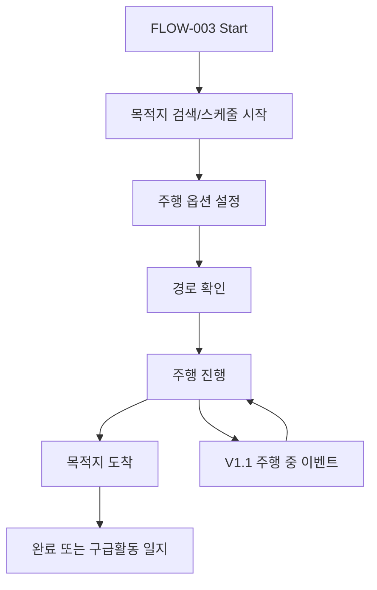
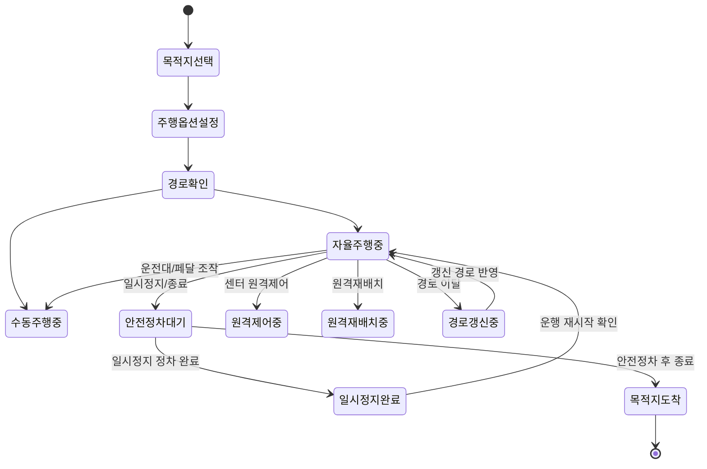

# Full Flow

이 문서는 전체 플로우 인덱스다. 상세 역기획은 [flows/](./flows/) 아래에 플로우별 문서로 작성한다.

## 1. Flow Inventory

| Flow ID | 플로우명 | 목적 | 시작 화면 | 종료 화면 | 상세 문서 | 상태 |
| --- | --- | --- | --- | --- | --- | --- |
| FLOW-003 | 자율주행 생성 및 컨트롤 | 목적지 기반 운행 생성, 주행 옵션 설정, 경로 확인, 주행 시작/제어, V1.1 주행 중 상태/알림/원격 요청 처리, 종료 후 분기 | 메인화면 | 완료 또는 FLOW-006 구급활동 일지 진입 | [flows/FLOW-003_autonomous-driving-creation-control.md](./flows/FLOW-003_autonomous-driving-creation-control.md) | Draft |
| FLOW-006 | 구급활동 일지 | 응급 출동 후 구급활동 일지 작성 | FLOW-003 일지 생성 | 일지 저장 또는 종료 | TBD | Planned |

## 2. Flow Processing Order

플로우는 사용자가 제공하는 순서대로 정리한다.

| 순서 | Flow ID | 플로우명 | 입력 상태 | 문서화 상태 | 확인 상태 |
| --- | --- | --- | --- | --- | --- |
| 3 | FLOW-003 | 자율주행 생성 및 컨트롤 | Received | V1.1 Updated | Needs Review |

## 3. Cross-Flow State Map

여러 플로우에 걸쳐 공유되는 상태를 정리한다.

| State ID | 상태명 | 관련 플로우 | 관련 화면 | 설명 | 상태 |
| --- | --- | --- | --- | --- | --- |
| STATE-301 | 주소 검색 전 | FLOW-003 | SCR-302 | 검색창 바로 아래 즐겨찾기와 최근 검색 주소 최대 5개를 보여주는 상태 | Confirmed |
| STATE-302 | 주소 검색 결과 | FLOW-003 | SCR-303 | 검색어에 맞는 주소 후보를 보여주는 상태 | Observed |
| STATE-303 | 경로 확인 - 자율주행 | FLOW-003 | SCR-307 | 출발지/목적지와 경로를 보여주고 재요청/주행시작 제공 | Observed |
| STATE-304 | 경로 확인 - 수동주행 | FLOW-003 | SCR-308 | 수동 주행 시 경로 정보 미제공 안내와 `확인` CTA | Confirmed |
| STATE-305 | 자율주행 진행 | FLOW-003 | SCR-309 | ETA와 일시 중지/종료 제어 제공 | Observed |
| STATE-306 | 수동주행 진행 | FLOW-003 | SCR-310 | 경로 정보 미제공 안내와 주행 종료 제공 | Observed |
| STATE-401 | 자율주행중 | FLOW-003 | SCR-309 | 실시간 차량 상태, 주행 모드, 자율주행 제어 패널 표시 | Draft |
| STATE-402 | 수동주행중 | FLOW-003 | SCR-309, SCR-310 | 수동주행 진행 또는 자율주행 중 수동 전환 후 상태 | Draft |
| STATE-404 | 원격재배치중 | FLOW-003 | SCR-302, SCR-303, SCR-309 | 원격재배치 버튼으로 경로 검색에 진입한 뒤 목적지 선택 후 표기되는 주행 상태 | Draft |
| STATE-405 | 안전정차대기 | FLOW-003 | SCR-309 | 일시정지/종료 요청 후 안전한 자리에 정차하기 전까지 제어가 잠기고 화면이 프리즈된 상태 | Confirmed |
| STATE-407~408 | 일시정지 완료/운행 재시작 확인 | FLOW-003 | SCR-309 | 정차 후 `운행 재시작` 버튼과 기존 경로 재시작 확인/취소 알트 | Confirmed |
| STATE-421~428 | 원격주행 요청 상태 | FLOW-003 | SCR-305, SCR-309 | EMS->센터 또는 센터->EMS 원격주행 요청, 승인, 거절, 타임아웃 상태 | Draft |
| STATE-441~444 | 차량상태 조회 상태 | FLOW-003 | SCR-305, SCR-309 | 대기/주행중/비정상/미응답 상태 | 협의 필요 |
| STATE-481~485 | 경로 표시/갱신 상태 | FLOW-003 | SCR-307, SCR-309 | 일반/응급 경로 표시, 경로 이탈, 경로 갱신중, 갱신 경로 반영 | Draft |
| STATE-501~503 | 주행 중 알림 상태 | FLOW-003 | SCR-309 | 긴급 경로 진입 예정, 수동 전환, 원격주행 요청 알림 | Draft |

## 4. V1.1 Flow Summary

## 5. V1.1 Event Flow Index

| Event Flow ID | 이벤트 흐름 | 시작 조건 | 관련 화면 | 관련 기능 | 상태 |
| --- | --- | --- | --- | --- | --- |
| EVT-1.1-001 | 응급/일반 경로 표시 전환 | 응급 자율주행 경로 확인 진입 | SCR-307 | FEAT-305 | Draft |
| EVT-1.1-002 | EMS->센터 원격주행 요청 | SCR-305에서 원격 주행 신청 | SCR-305, SCR-309 | FEAT-313 | Draft |
| EVT-1.1-003 | 센터->EMS 원격주행 요청 | 센터가 EMS에 원격주행 요청 송신 | SCR-309 | FEAT-313 | Draft |
| EVT-1.1-004 | 긴급 경로 진입 알림 | 센터가 긴급 경로 진입 예정 이벤트 송신 | SCR-309 | FEAT-314 | Draft |
| EVT-1.1-005 | 자율주행 중 수동 전환 | 운전대/페달 조작 감지 | SCR-309 | FEAT-315 | Draft |
| EVT-1.1-006 | 안전정차대기 | 일시정지 또는 주행 종료 선택 | SCR-309 | FEAT-316 | Draft |
| EVT-1.1-007 | 경로 이탈 및 경로 갱신 | 차량이 현재 주행경로 이탈 | SCR-309 | FEAT-317 | Draft |
| EVT-1.1-008 | 원격재배치 상태 표기 | 원격재배치 버튼으로 경로 검색 진입 | SCR-302, SCR-303, SCR-309 | FEAT-318 | Draft |

## 6. Global State Flow

앰뷸런스/미션/환자/연동 상태처럼 여러 화면에 걸쳐 영향을 주는 상태를 정리한다.

## 7. Open Flow Decisions

| Decision ID | 내용 | 관련 Flow | 상태 |
| --- | --- | --- | --- |
| Q-309 | 스케줄의 `스케줄 시작`은 주행 옵션으로 바로 이동한다. | FLOW-003 | Applied |
| Q-305 | `재요청`은 경로만 다시 생성한다. | FLOW-003 | Applied |
| Q-306 | `일시 중지` 후 정차 전 화면 프리즈, 정차 후 운행 재시작, 기존 경로 재시작 확인/취소 알트를 제공한다. | FLOW-003 | Applied |
| Q-307 | `주행 종료` 실행 전 확인 모달이 필요하다. | FLOW-003 | Applied |
| DEC-1.1-002 | EMS->센터 원격주행 요청 승인 타임아웃 시간 | EVT-1.1-002 | 협의 필요 |
| DEC-1.1-003 | 센터->EMS 원격주행 요청 승인/거절 타임아웃 시간 및 기본 처리 | EVT-1.1-003 | 협의 필요 |
| DEC-1.1-004 | 긴급 경로 진입 알림 선행 시간 NN초 | EVT-1.1-004 | 협의 필요 |
| DEC-1.1-005 | 차량상태 대기/주행중/비정상 판정 기준 | FLOW-003 | 협의 필요 |
| DEC-1.1-006 | 자율주행 시스템에 의한 자동 종료 시퀀스 | FLOW-003 | 협의 필요 |
| DEC-1.1-009 | 차량 상태 정보 수신 주기를 100ms가 아닌 500ms 간격으로 적용 가능한가? | FLOW-003 | 협의 필요 |
