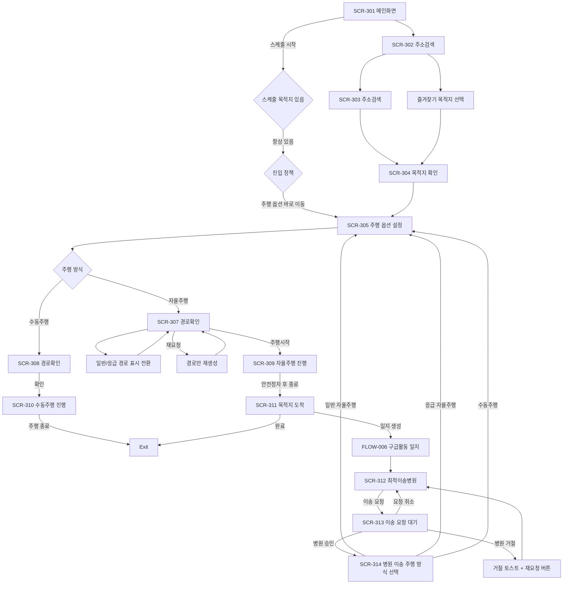

# FLOW-003. 자율주행 생성 및 컨트롤

## 1. Flow Metadata

| 항목 | 내용 |
| --- | --- |
| Flow ID | FLOW-003 |
| 플로우명 | 자율주행 생성 및 컨트롤 |
| 제공 순서 | 3 |
| Figma 기준 | `423:3781` / 3. 자율주행 생성 및 컨트롤 |
| Figma URL | https://www.figma.com/design/s1RHxrQRnSHRv7DmtCEVGB/EMS-%ED%82%A4%EC%98%A4%EC%8A%A4%ED%81%AC?node-id=423-3781&t=lXCUhcAxXJaTqNrW-1 |
| 캡처 증거 | [FLOW-003_node-423-3781.png](../figma/FLOW-003_node-423-3781.png) |
| 관련 화면 | SCR-301 ~ SCR-314 |
| 관련 기능 | FEAT-301 ~ FEAT-318 |
| 기준 버전 | V1.1 |
| 작성 상태 | Draft |

## 2. Flow Purpose

### Observed

- 메인 화면에서 `운행 목적지`를 검색하거나 스케줄의 `스케줄 시작`을 통해 주행 생성 흐름에 진입한다.
- 주소 검색 후 목적지를 지도에서 확인하고 `경로 생성`을 실행한다.
- 경로 확인 화면에서 `재요청` 또는 `주행시작`을 선택한다.
- 자율주행 진행 중에는 `일시 중지`, `주행 종료`, `도착 예정 시간`이 표시된다.
- 수동 주행 화면에는 `수동 주행 시 경로 정보는 제공되지 않습니다.` 문구와 `주행 종료`만 표시된다.
- 종료 후 일반 출동은 `완료`, 응급 출동은 `일지 생성`만 표시된다는 피그마 주석이 있다.
- 최적이송병원 추천 결과는 별도 AI API를 통해 전달받으며 앱은 추천 산정 기준을 구현하지 않는다.
- 추천 병원으로 이송요청을 하면 병원 별도 기기에서 승인 또는 거절을 진행한다.
- 병원 이송 시 사용자는 `일반 자율 주행`, `응급 자율 주행`, `수동주행` 중 하나를 선택할 수 있고, 선택한 방식에 따라 자율주행 생성 루프로 재진입한다.

### V1.1 Changes

- 운행 앰뷸런스가 1대로 변경되어 사용자가 차량을 선택하는 SCR-306 단계는 V1.1 기본 플로우에서 제거한다.
- 차량상태 조회는 사용자 선택 프로세스가 아니라 시스템 상태 확인으로 처리한다.
- 응급 자율주행 경로 생성 시 센터시스템은 응급 경로와 일반 경로를 모두 제공한다.
- EMS 키오스크는 카카오맵 위 단추 메뉴로 일반/응급 경로 표시만 전환한다.
- 자율주행 진행 중 차량속도, 차량위치, 차량방향(heading), 자율주행모드를 표시한다.
- EMS->센터 원격주행 요청과 센터->EMS 원격주행 요청을 모두 처리한다.
- 자율주행 중 긴급 경로 진입 예정 알림을 표시한다.
- 자율주행 중 운전대/페달 조작 시 SCR-309에 수동 전환 알림을 표시한다.
- 주행 일시정지/종료는 즉시 완료되지 않고 안전정차대기 후 완료된다.
- 경로 이탈 시 센터가 카카오 API로 경로를 재생성하고 갱신 주행경로를 ADS에 전달한다.
- 원격재배치 버튼으로 경로 검색에 진입한 경우 목적지 선택 후 주행 상태를 원격재배치중으로 표기한다.
- 병원 이송요청 거절 시 `00병원에서 이송요청을 거절하였습니다.` 토스트 표시 후 해당 병원 액션을 재요청 버튼으로 변경한다.

### Inferred

- V1.1의 핵심은 신규 화면을 대량 추가하는 것이 아니라 기존 SCR-305, SCR-307, SCR-309에 상태/알림/제어 분기를 추가하는 구조다.
- 주행 중 발생하는 센터/차량 이벤트는 SCR-309를 중심으로 표시한다.
- 스케줄은 항상 목적지를 저장하고 있으므로 주소 검색과 목적지 확인 단계를 거치지 않고 주행 옵션으로 바로 이동한다.

## 3. Start / End Conditions

| 구분 | 조건 | 근거 | 상태 |
| --- | --- | --- | --- |
| 시작 조건 | 메인 화면의 목적지 검색 또는 스케줄 시작 | `메인화면`, `출동 주소를 검색하세요`, `스케줄 시작` | Inferred |
| 시작 조건 - 스케줄 | 스케줄은 항상 목적지를 저장하고 있음 | 사용자 확인 | Confirmed |
| 종료 조건 | 주행 종료 후 일반 출동은 완료, 응급 출동은 일지 생성으로 후속 처리 | 피그마 주석 및 사용자 확인 | Confirmed |
| 종료 조건 - 수동 전환 후 종료 | 자율주행 중 수동 전환 알림에서 정차 상태로 주행 종료 선택 | CHG-1.1-006 | Draft |

## 4. Screen Sequence

| Step | Screen ID | 화면명 | Figma Node | 화면 역할 | 다음 단계 조건 | V1.1 상태 |
| --- | --- | --- | --- | --- | --- | --- |
| 1 | SCR-301 | 메인화면 | `423:3782` | 목적지 검색 또는 스케줄 시작 진입 | 주소 검색 선택 또는 스케줄 시작 | 유지 |
| 2 | SCR-302 | 주소검색 | `423:3862` | 주소 검색 입력 전 최근 검색/즐겨찾기 표시 | 검색어 입력 또는 즐겨찾기 선택 | 변경 |
| 3 | SCR-303 | 주소검색 | `423:3885` | 검색어 기반 주소 후보 표시 | 주소 후보 선택 | 변경 |
| 4 | SCR-304 | 목적지 확인 | `423:3908` | 선택한 목적지를 지도에서 확인 | 경로 생성 | 유지 |
| 5 | SCR-305 | 주행 옵션 설정 | `423:3919` | 주행 방식, 출동 유형, 원격 주행 신청 | 경로 생성 또는 원격 주행 신청 | 변경 |
| 6 | SCR-306 | 운행 차량 선택 | `424:6024` | 기존 차량 선택 화면 | V1.1 기본 플로우에서 제거 | Deprecated |
| 7A | SCR-307 | 경로확인 | `423:3946` | 자율주행 출발지/목적지와 지도 경로 확인 | 표시 경로 전환, 재요청, 주행시작 | 변경 |
| 7B | SCR-308 | 경로확인 | `423:5958` | 수동주행 경로 정보 미제공 안내. 실제 경로 생성이 아니므로 CTA는 `확인` | 확인 | 변경 |
| 8A | SCR-309 | 자율주행 진행 | `423:3961` | 자율주행 중 지도, 상태, 알림, 제어 | 일시정지/종료/이벤트 수신 | 변경 |
| 8B | SCR-310 | 수동주행 진행 | `423:5989` | 수동주행 중 경로 정보 미제공 안내, 종료 제어 | 주행 종료 | 유지 |
| 9 | SCR-311 | 목적지 도착 | `423:3975` | 목적지 도착 후 완료/목적지 추가/일지 생성 분기 | 완료 또는 일지 생성 | 유지 |
| 9B | FLOW-006 | 구급활동 일지 | `423:4101` | 응급 출동 후 구급활동 일지 플로우로 이동 | 일지 생성 | 유지 |
| 10 | SCR-312 | 최적이송병원 | `423:4019` | AI API 추천 결과 표시 및 병원 이송요청 | 이송 요청 | 변경 |
| 11 | SCR-313 | 이송 요청 대기 | `423:4065` | 병원 이송요청 후 승인 대기/요청 취소 상태 | 병원 승인/거절 또는 요청 취소 | 변경 |
| 12 | SCR-314 | 병원 이송 주행 방식 선택 | `423:4077` | 병원 이송 시 일반 자율주행/응급 자율주행/수동주행 선택 | 선택한 방식으로 SCR-305 재진입 | 변경 |

## 5. Main Flow Diagram

## 6. Step Details

| Step | Actor | User/System Action | App Response | System/External Response | Related Policy | Related Question |
| --- | --- | --- | --- | --- | --- | --- |
| 1 | 사용자 | 목적지 검색 영역 선택 | 주소 검색 진입 | 최근 검색/즐겨찾기 데이터 표시 | POL-301 | Q-301 |
| 1S | 사용자 | 스케줄 시작 선택 | 주행 옵션 진입 | 스케줄 목적지는 항상 존재 | POL-302 | Q-309 |
| 2 | 사용자 | 주소 검색어 입력 | 검색 결과 표시 | 주소 검색 API 또는 내부 주소 DB 조회. 최근 검색은 최대 5개, 최신순, 1개월 보관 | POL-301 | Q-301 |
| 3 | 사용자 | 주소 후보 또는 즐겨찾기 선택 | 목적지 확인 지도 표시 | 지도/좌표 변환. 즐겨찾기 등록/수정은 별도 관리 화면에서 처리 | POL-302, POL-411 | Q-302 |
| 4 | 사용자 | 경로 생성 선택 | 주행 옵션 설정 표시 | 목적지 좌표 유지 | POL-302 | - |
| 5 | 사용자 | 수동/자율, 일상/응급 선택 | 필수 옵션 선택 후 경로 생성 또는 확인 가능. 기본값 없음 | 차량상태 조회는 시스템 처리 | POL-303, POL-401, POL-402 | Q-303, IA-Q-1.1-004 |
| 5R | 사용자 | 원격 주행 신청 | 센터 승인대기 표시 | EMS->센터 원격주행 요청 송신. 원격 신청은 SCR-305 안의 주행 옵션이며 EMS->센터 신청만 제공 | POL-404, POL-407 | IA-Q-1.1-001, DEC-1.1-002 |
| 6 | 시스템 | 차량상태 조회 | 대기/주행중/비정상 또는 타임아웃 안내 | 10초 내 미응답 시 타임아웃 | POL-402 | DEC-1.1-005 |
| 7A | 사용자 | 응급 자율주행 경로 확인 | 일반/응급 경로 표시 전환 제공 | 센터가 일반/응급 경로 모두 제공 | POL-403 | - |
| 7B | 사용자 | 수동주행 확인 | 경로 정보 미제공 안내와 `확인` CTA 표시 | 실제 경로 생성 없음 | POL-303 | Q-310 |
| 8A | 사용자 | 자율주행 주행시작 | SCR-309 진입 | 주행 시작 처리 | POL-405, POL-406 | - |
| 8B | 사용자 | 수동주행 주행시작 | SCR-310 진입 | 수동주행 처리 | POL-303 | - |
| 9A | 사용자 | 자율주행 일시정지 | 차량 정차모드 전환, 완전 정차 전까지 화면 프리즈 | 안전 정차 완료 후 `운행 재시작` 버튼 표시 | POL-405 | Q-306 |
| 9A-2 | 사용자 | `운행 재시작` 선택 | `기존 경로 재시작 하겠습니까?` 확인/취소 알트 표시 | 확인 시 기존 경로로 자율주행 재개, 취소 시 알트 닫힘 | POL-405 | Q-306 |
| 9A-3 | 사용자 | 자율주행 주행 종료 | 주행 종료 확인 모달 표시 후 안전정차대기 표시, 컨트롤 패널 락 | 안전 정차 완료 후 종료 후속 처리 | POL-405 | Q-307 |
| 9B | 시스템 | 주행 중 실시간 차량 상태 수신 | 차량속도/위치/heading/자율주행모드 표시 | 수신 주기 100ms 또는 500ms 협의 | POL-406, POL-413 | DEC-1.1-009 |
| 10 | 시스템 | 운전대/페달 조작 감지 | SCR-309 수동 전환 알림 표시 | 센터가 수동모드 변경 알람 송신 | POL-409 | - |
| 11 | 사용자 | 수동 전환 알림에서 주행 종료/재요청 선택 | 정차 여부 검증 | 미정차 시 토스트, 정차 시 실행 | POL-409 | - |
| 12 | 시스템 | 긴급 경로 진입 예정 이벤트 수신 | 긴급 경로 유형 알림 표시 | 알림 선행 시간 협의 필요 | POL-408 | DEC-1.1-004 |
| 13 | 시스템 | 경로 이탈 이벤트 수신 | 경로 갱신중 상태 표시 가능 | 센터가 카카오 API 경로 재생성, ADS 전달 | POL-410 | - |
| 14 | 사용자 | 자율주행 목적지 도착 또는 종료 알트에서 완료/일지 생성 선택 | 완료 또는 FLOW-006 진입 | 운행 결과 저장 | POL-307 | - |
| 15 | 사용자 | 이송 병원 추천 선택 | SCR-312 추천 결과 표시 | 외부 AI API 추천 결과 | POL-310 | - |
| 16 | 사용자 | 병원 이송요청 | SCR-313 승인 대기 표시 | 병원 별도 기기에서 승인/거절 | POL-311, POL-412 | - |
| 17 | 시스템 | 병원 이송요청 거절 | `00병원에서 이송요청을 거절하였습니다.` 토스트, 재요청 버튼 표시 | 병원 별도 기기 거절 | POL-412 | - |
| 18 | 사용자 | 병원 승인 후 주행 방식 선택 | SCR-305 재진입, 차량 선택 생략 | 선택 병원을 목적지로 경로/주행 생성 | POL-312, POL-401 | Q-314 |

## 7. V1.1 Event Flows

### EVT-1.1-001. 응급/일반 경로 표시 전환

| Step | Actor | Action | App Response | 상태 |
| --- | --- | --- | --- | --- |
| 1 | 센터시스템 | 응급 자율주행 경로 생성 결과로 일반 경로와 응급 경로를 모두 송신 | SCR-307에 경로 확인 표시 | Draft |
| 2 | 사용자 | 일반/응급 경로 표시 단추 선택 | 카카오맵 위 표시 경로만 전환 | Draft |
| 3 | 사용자 | 재요청 선택 | 옵션 단계로 돌아가지 않고 경로만 재생성 | Confirmed |
| 4 | 사용자 | 주행시작 선택 | SCR-309 자율주행 진행 진입 | Draft |

### EVT-1.1-002. EMS->센터 원격주행 요청

| Step | Actor | Action | App Response | 상태 |
| --- | --- | --- | --- | --- |
| 1 | 사용자 | SCR-305에서 원격 주행 신청 | 센터 승인대기 표시 | Draft |
| 2 | 센터시스템 | 승인 | SCR-309 자율주행 진행 화면 유지 또는 진입 | Draft |
| 3 | 센터시스템 | 거절 | 거절 안내 후 SCR-305 또는 기존 진행 화면 복귀 | Draft |
| 4 | 시스템 | 타임아웃 | 타임아웃 안내 표시 | 협의 필요 |

### EVT-1.1-003. 센터->EMS 원격주행 요청

| Step | Actor | Action | App Response | 상태 |
| --- | --- | --- | --- | --- |
| 1 | 센터시스템 | EMS에 원격주행 요청 송신 | 화면 위치와 무관한 글로벌 승인/거절 알림 표시 | Confirmed |
| 2 | 사용자 | 승인 선택 | 승인 결과 송신, 자율주행 진행 화면 유지 | Draft |
| 3 | 사용자 | 거절 선택 | 거절 결과 송신, 기존 상태 유지 | Draft |
| 4 | 시스템 | 타임아웃 | 타임아웃 안내 또는 알림 종료 | 협의 필요 |

### EVT-1.1-004. 긴급 경로 진입 알림

| Step | Actor | Action | App Response | 상태 |
| --- | --- | --- | --- | --- |
| 1 | 센터시스템 | 긴급 경로 진입 예정 이벤트 송신 | SCR-309에 진입 예정 긴급경로 유형 표시 | Draft |
| 2 | 사용자 | 알림 확인 또는 주행 지속 | 알림 종료 또는 주행 화면 유지 | Draft |

긴급 경로 유형: 길터주기 요청 운행, 교차로 우선통행, 앞지르기운행, 중앙선 긴급유턴, 중앙선 긴급회단, 갓길주행.

### EVT-1.1-005. 자율주행 중 수동 전환

| Step | Actor | Action | App Response | 상태 |
| --- | --- | --- | --- | --- |
| 1 | 운전자 | 자율주행 중 운전대 또는 페달 조작 | 즉시 수동 모드 전환 | Draft |
| 2 | 센터시스템 | 수동모드 변경 알람 송신 | SCR-309에 수동 주행중 알림 표시 | Draft |
| 3 | 사용자 | 미정차 상태에서 주행 종료 또는 자율주행 재요청 선택 | `정차시에만 상태 변경이 가능합니다` 토스트 | Draft |
| 4 | 사용자 | 정차 상태에서 주행 종료 선택 | 수동주행과 자율주행 이벤트 모두 종료 | Draft |
| 5 | 사용자 | 정차 상태에서 자율주행 재요청 선택 | 이벤트 유지, 자율주행 코스 재산정 | Draft |

SCR-310은 원래 수동주행 화면이므로 별도 수동 전환 알림 대상이 아니다.

### EVT-1.1-006. 안전정차대기 및 컨트롤 패널 락

| Step | Actor | Action | App Response | 상태 |
| --- | --- | --- | --- | --- |
| 1 | 사용자 | 자율주행 중 일시정지 선택 | 차량 정차모드 전환 및 화면 프리즈 | Confirmed |
| 2 | 앱 | 안전 정차 전 | 컨트롤 패널 락, 화면 프리즈 유지 | Confirmed |
| 3 | 자율주행 시스템 | 안전 정차 완료 상태 송신 | 프리즈 해제, `일시정지` 버튼을 `운행 재시작`으로 변경 | Confirmed |
| 4 | 사용자 | `운행 재시작` 선택 | `기존 경로 재시작 하겠습니까?` 확인/취소 알트 표시 | Confirmed |
| 5 | 사용자 | 확인 선택 | 기존 경로로 자율주행 재개 | Confirmed |
| 6 | 사용자 | 취소 선택 | 알트 닫힘, 일시정지 완료 상태 유지 | Confirmed |
| 7 | 사용자 | 자율주행 중 주행 종료 선택 | 주행 종료 확인 모달 표시 후 안전정차대기 | Confirmed |

### EVT-1.1-007. 경로 이탈 및 경로 갱신

| Step | Actor | Action | App Response | 상태 |
| --- | --- | --- | --- | --- |
| 1 | 센터시스템 | 차량 경로 이탈 감지 | SCR-309에 경로 이탈 또는 경로 갱신중 상태 표시 가능 | Draft |
| 2 | 센터시스템 | 카카오 API에 경로 재생성 요청 | EMS에는 갱신중 상태 유지 가능 | Draft |
| 3 | 센터시스템 | 갱신 주행경로를 ADS에 전달 | EMS 키오스크에 갱신 경로 반영 | Draft |

### EVT-1.1-008. 원격재배치 상태 표기

| Step | Actor | Action | App Response | 상태 |
| --- | --- | --- | --- | --- |
| 1 | 사용자 또는 센터 | 원격재배치 버튼으로 경로 검색 진입 | SCR-302/SCR-303 목적지 선택 흐름 사용, 주소 검색창 바로 아래 즐겨찾기 표시 | Draft |
| 2 | 사용자 | 주소 또는 즐겨찾기 선택 | 목적지 선택 처리 | Draft |
| 3 | 시스템 | 후속 주행 시작 | 주행 상태를 원격재배치중으로 표기 | Draft |

즐겨찾기는 항상 즐겨찾기 목적지 선택 기능이며, 원격재배치 목적지 유형으로 바뀌지 않는다.

## 8. Extracted Features

| Feature ID | 기능명 | 발생 Step/Event | 관련 화면 | 설명 | 상태 |
| --- | --- | --- | --- | --- | --- |
| FEAT-301 | 목적지 검색 | 1~3, EVT-1.1-008 | SCR-301, SCR-302, SCR-303 | 최근 검색 최대 5개/최신순/1개월 보관, 즐겨찾기, 검색 결과로 출동 주소를 선택 | Confirmed |
| FEAT-302 | 목적지 확인 및 경로 생성 | 4 | SCR-304 | 선택 주소 또는 스케줄 목적지를 지도에서 확인하고 경로 생성을 시작 | Draft |
| FEAT-303 | 주행 옵션 설정 | 5, 5R | SCR-305 | 수동/자율, 일상/응급 필수 선택, 기본값 없음, EMS->센터 원격 주행 신청 설정 | Confirmed |
| FEAT-304 | 앰뷸런스 차량상태 조회 | 6 | SCR-305, SCR-309 | 단일 운행 앰뷸런스 상태 조회 및 10초 타임아웃 처리 | Draft |
| FEAT-305 | 경로 확인 및 표시 전환 | 7A, EVT-1.1-001 | SCR-307 | 일반/응급 경로 표시 전환, 재요청, 주행시작 | Draft |
| FEAT-306 | 주행 시작 및 진행 제어 | 8~9 | SCR-309, SCR-310 | 주행 시작 후 일시정지/종료/안전정차대기, 정차 후 운행 재시작, 종료 확인 모달 처리 | Confirmed |
| FEAT-307 | 운행 종료 후 분기 | 14 | SCR-311, FLOW-006 | 일반 출동 완료, 응급 출동 구급활동 일지 진입 | Confirmed |
| FEAT-310 | 최적이송병원 추천 | 15~18 | SCR-312, SCR-313 | AI API 추천 결과 표시 및 병원 이송요청 | Confirmed |
| FEAT-311 | 병원 이송 주행 루프 | 18 | SCR-314, SCR-305 | 병원 승인 후 주행 생성 루프로 재진입, 차량 선택 생략 | Draft |
| FEAT-312 | 실시간 차량 상태 표기 | 9B | SCR-309 | 차량속도, 위치, heading, 자율주행모드 표시 | 협의 필요 |
| FEAT-313 | 원격 자율주행 요청 | EVT-1.1-002, EVT-1.1-003 | SCR-305, SCR-309 | 양방향 원격주행 요청/승인/거절/타임아웃 | Draft |
| FEAT-314 | 긴급 경로 진입 알림 | EVT-1.1-004 | SCR-309 | 긴급 경로 유형 진입 전 알림 | Draft |
| FEAT-315 | 자율주행 중 수동 전환 | EVT-1.1-005 | SCR-309 | 수동 전환 알림 및 후속 제어 | Draft |
| FEAT-316 | 안전정차대기 및 컨트롤 패널 락 | EVT-1.1-006 | SCR-309 | 안전 정차 전 제어 제한 | Draft |
| FEAT-317 | 경로 이탈 및 주행경로 갱신 | EVT-1.1-007 | SCR-309 | 경로 이탈 후 센터 경로 재생성 및 ADS 전달 | Draft |
| FEAT-318 | 원격재배치 상태 표기 | EVT-1.1-008 | SCR-302, SCR-303, SCR-309 | 원격재배치 진입 후 후속 주행 상태 표기 | Draft |

## 9. Policies

| Policy ID | 정책 | 발생 Step/Event | 상태 |
| --- | --- | --- | --- |
| POL-301 | 목적지는 검색, 최근 검색, 즐겨찾기에서 선택할 수 있다. 최근 검색은 최대 5개, 최신순, 1개월 보관이며 1개월 경과 또는 5개 초과 시 자동 삭제한다. 즐겨찾기 등록/수정은 별도 관리 화면에서 처리한다. | 1~3 | Confirmed |
| POL-401 | V1.1에서는 운행 앰뷸런스가 1대이므로 사용자 차량 선택 프로세스를 제거한다. | 5~6 | Confirmed |
| POL-402 | 차량상태 조회 미응답 시 10초 타임아웃 처리한다. | 6 | Draft |
| POL-403 | 응급 자율주행 경로 확인에서는 일반 경로와 응급 경로 표시를 전환할 수 있으며, 이 동작은 표시 전환에 한정된다. | 7A | Draft |
| POL-405 | 주행 일시정지와 종료는 즉시 완료가 아니라 안전한 자리에 정차한 이후 완료된다. 일시정지는 완전 정차 전 화면 프리즈, 정차 후 `운행 재시작`, 기존 경로 재시작 확인 알트를 거친다. 주행 종료 전에는 확인 모달을 표시한다. | 9A | Confirmed |
| POL-406 | 실시간 차량 상태 표기 항목은 차량속도, 차량위치, 차량방향(heading), 자율주행모드다. | 9B | Confirmed |
| POL-407 | 원격주행 타임아웃 시간과 기본 처리는 협의 필요로 관리한다. | EVT-1.1-002, EVT-1.1-003 | 협의 필요 |
| POL-408 | 긴급 경로 진입 알림 선행 시간은 협의 필요로 관리한다. | EVT-1.1-004 | 협의 필요 |
| POL-409 | 자율주행 중 수동 전환 후 주행 종료/자율주행 재요청은 정차시에만 실행할 수 있다. | EVT-1.1-005 | Draft |
| POL-410 | 경로 이탈 시 센터가 카카오 API로 경로를 재생성하고 ADS에 갱신 주행경로를 전달한다. | EVT-1.1-007 | Draft |
| POL-411 | 주소 검색창 바로 아래에 즐겨찾기를 표시한다. 즐겨찾기는 원격재배치 목적지 유형이 아니라 항상 즐겨찾기이며, 원격재배치 버튼 진입 여부에 따라 후속 상태만 원격재배치중으로 표시한다. | EVT-1.1-008 | Confirmed |
| POL-412 | 병원 이송요청 거절 시 `00병원에서 이송요청을 거절하였습니다.` 토스트 표시 후 해당 병원 액션을 재요청 버튼으로 변경한다. | 17 | Confirmed |
| POL-413 | 차량 상태 정보 수신 주기를 100ms가 아닌 500ms 간격으로 적용 가능한지 협의한다. | 9B | 협의 필요 |

## 10. Data and Integration

| Data ID | 데이터/연동 | 사용 Step/Event | 출처 | 표시/전송/저장 | 상태 |
| --- | --- | --- | --- | --- | --- |
| DATA-301 | 출동 주소 | 1~8 | 주소 검색/즐겨찾기/스케줄 | 화면 표시, 경로 생성 입력 | Observed |
| DATA-303 | 즐겨찾기 주소 | 2~3, EVT-1.1-008 | 사용자 저장 주소 | 주소 검색 화면 표시 | Confirmed |
| DATA-304 | 스케줄 목적지 | 1S | 스케줄 | 스케줄 시작 시 목적지로 사용 | Confirmed |
| DATA-401 | 원격주행 요청 상태 | 5R, EVT-1.1-002, EVT-1.1-003 | EMS/센터 | 승인대기/승인/거절/타임아웃 표시 및 송신 | Draft |
| DATA-402 | 차량상태 | 6 | 차량 시스템/센터 | 대기/주행중/비정상 표시 | 협의 필요 |
| DATA-403 | 차량상태 조회 타임아웃 | 6 | EMS 키오스크 | 10초 타임아웃 처리 | Draft |
| DATA-404 | 일반 경로 | 7A | 센터시스템 | 지도 표시 | Draft |
| DATA-405 | 응급 경로 | 7A | 센터시스템 | 지도 표시 | Draft |
| DATA-407 | 안전 정차 상태 | 9A, EVT-1.1-006 | 자율주행 시스템/센터 | 컨트롤 패널 락 및 후속 처리 | Draft |
| DATA-408 | 차량속도 | 9B | 센터 또는 ADS | SCR-309 표시 | Confirmed |
| DATA-409 | 차량위치 | 9B | 센터 또는 ADS | SCR-309 표시 | Confirmed |
| DATA-410 | 차량방향(heading) | 9B | 센터 또는 ADS | SCR-309 표시 | Confirmed |
| DATA-411 | 자율주행모드 | 9B | 센터 또는 ADS | SCR-309 표시 | Confirmed |
| DATA-412 | 차량 상태 정보 수신 주기 | 9B | API/Event Contract | 100ms 또는 500ms 협의 | 협의 필요 |
| DATA-417 | 긴급 경로 진입 예정 유형 | EVT-1.1-004 | 센터시스템 | SCR-309 알림 표시 | Draft |
| DATA-418 | 수동모드 변경 알람 | EVT-1.1-005 | 센터시스템 | SCR-309 알림 표시 | Draft |
| DATA-419 | 경로 이탈 이벤트 | EVT-1.1-007 | 센터시스템 | SCR-309 상태 표시 | Draft |
| DATA-420 | 갱신 주행경로 | EVT-1.1-007 | 센터시스템/카카오 API | ADS 전달, EMS 경로 표시 | Draft |
| DATA-421 | 주행 모드 | 9B, EVT-1.1-008 | 센터 또는 ADS | SCR-309 표시 | Draft |
| DATA-422 | 원격재배치 진입 플래그 | EVT-1.1-008 | EMS 키오스크 | 후속 주행 상태 원격재배치중 표기 | Draft |

## 11. Exceptions

| ID | 예외 상황 | 발생 조건 | 앱 동작 | 복구 방법 | 질문 |
| --- | --- | --- | --- | --- | --- |
| EXC-301 | 경로 재요청 | 생성 경로가 부적절하거나 사용자가 재요청 선택 | 경로만 재생성 | 경로 재생성 후 재확인 | Q-305 |
| EXC-302 | 수동주행 경로 정보 없음 | 수동주행 선택 | 경로 정보 미제공 문구와 `확인` CTA 표시 | 확인 후 수동주행 진행 | Q-310 |
| EXC-401 | 차량상태 미응답 | 차량상태 조회 후 10초 초과 | SCR-305에 타임아웃 안내 표시 | 재조회 또는 상태 수신 대기 | IA-Q-1.1-004 |
| EXC-402 | EMS->센터 원격주행 타임아웃 | 센터 승인/거절 응답 시간 초과 | 타임아웃 안내 표시 | 재요청 또는 기존 상태 복귀 | DEC-1.1-002 |
| EXC-403 | 센터->EMS 원격주행 타임아웃 | EMS 승인/거절 응답 시간 초과 | 타임아웃 안내 또는 알림 종료 | 기본 처리 협의 필요 | DEC-1.1-003 |
| EXC-404 | 수동 전환 후 미정차 상태 변경 시도 | 미정차 상태에서 주행 종료 또는 자율주행 재요청 선택 | `정차시에만 상태 변경이 가능합니다` 토스트 | 정차 후 다시 선택 | - |
| EXC-405 | 병원 이송요청 거절 | 병원 별도 기기에서 거절 | `00병원에서 이송요청을 거절하였습니다.` 토스트 표시, 해당 병원 액션을 재요청 버튼으로 변경 | 재요청 버튼 선택 | - |
| EXC-406 | 경로 이탈 | 차량이 현재 경로를 이탈 | 경로 갱신중 상태 표시 가능 | 센터 재생성 경로 수신 후 반영 | - |

## 12. Open Questions

| Question ID | 질문 | 필요한 결정 | 우선순위 | 상태 |
| --- | --- | --- | --- | --- |
| Q-305 | `재요청`은 경로만 다시 생성하는가, 차량/옵션 선택 단계로 돌아가는가? | 경로만 다시 생성 | Medium | Applied |
| Q-306 | `일시 중지` 후 재개 방식은 무엇인가? | 정차 전 화면 프리즈, 정차 후 운행 재시작, 기존 경로 재시작 확인/취소 알트 | High | Applied |
| Q-307 | `주행 종료` 실행 전 확인 모달이 필요한가? | 필요 | High | Applied |
| Q-309 | 스케줄의 `스케줄 시작`은 목적지 확인을 거치는가, 주행 옵션으로 바로 이동하는가? | 주행 옵션으로 바로 이동 | Medium | Applied |
| Q-310 | 수동주행에서도 `경로 생성` 버튼을 사용하는 이유와 생성되는 데이터는 무엇인가? | 실제 경로 생성이 아니므로 CTA를 `확인`으로 변경 | High | Applied |
| Q-314 | 병원 이송 주행 방식 선택 후 정확히 어느 단계로 재진입하는가? | SCR-305 주행 옵션 설정으로 재진입 | Medium | Applied |
| IA-Q-1.1-001 | 원격 주행 신청은 주행 옵션 설정 안의 선택지인가, 별도 CTA인가? | SCR-305 안의 주행 옵션, EMS->센터 신청만 제공 | High | Applied |
| IA-Q-1.1-002 | 센터->EMS 원격주행 요청 알림은 주행 진행 화면에서만 표시하는가, 다른 화면에서도 글로벌 알림으로 표시하는가? | 화면 위치와 무관한 글로벌 알림 | High | Applied |
| IA-Q-1.1-004 | 차량상태 미응답 10초 타임아웃 안내를 어느 화면에서 표시할지 확정 필요하다. | SCR-305 | Medium | Applied |
| DEC-1.1-002 | EMS->센터 원격주행 요청 승인 타임아웃 시간 | 타임아웃 시간 | High | 협의 필요 |
| DEC-1.1-003 | 센터->EMS 원격주행 요청 승인/거절 타임아웃 시간 및 기본 처리 | 타임아웃 시간 및 기본 처리 | High | 협의 필요 |
| DEC-1.1-004 | 긴급 경로 진입 알람 선행 시간 NN초 | 알림 선행 시간 | High | 협의 필요 |
| DEC-1.1-005 | 차량상태 대기/주행중/비정상 판정 기준 | 차량상태 판정 기준 | High | 협의 필요 |
| DEC-1.1-006 | 자율주행 시스템에 의한 자동 종료 시퀀스 | 자동 종료 흐름 | High | 협의 필요 |
| DEC-1.1-007 | 주행 모드 상태값 표준 목록 및 표시 우선순위 | 상태값 표준 | High | 협의 필요 |
| DEC-1.1-009 | 차량 상태 정보 수신 주기를 100ms가 아닌 500ms 간격으로 적용 가능한가? | 상태 정보 수신 주기 | High | 협의 필요 |

## 13. Out of Scope

| ID | 범위 | 사유 | 연결 문서 |
| --- | --- | --- | --- |
| OSCOPE-301 | 구급활동 일지 작성 상세 | 사용자가 별도 플로우로 분리하기로 확인 | FLOW-006 예정 |
| OSCOPE-302 | 센터/ADS 내부 알고리즘 구현 | EMS 키오스크는 표시, 요청, 상태 처리 범위 | API/Event Contract 예정 |
