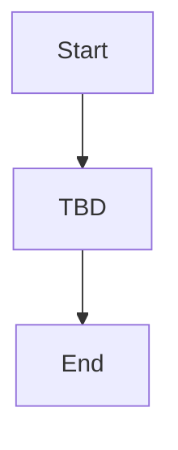

# FLOW-XXX. Flow Name

## 1. Flow Metadata

| 항목 | 내용 |
| --- | --- |
| Flow ID | FLOW-XXX |
| 플로우명 | TBD |
| 제공 순서 | TBD |
| Figma 기준 | TBD |
| 관련 화면 | TBD |
| 관련 기능 | TBD |
| 작성 상태 | Draft |

## 2. Flow Purpose

### Observed

- TBD

### Inferred

- TBD

### Questions

- TBD

## 3. Start / End Conditions

| 구분 | 조건 | 근거 | 상태 |
| --- | --- | --- | --- |
| 시작 조건 | TBD | TBD | Unknown |
| 종료 조건 | TBD | TBD | Unknown |

## 4. Screen Sequence

| Step | Screen ID | 화면명 | Figma Node | 화면 역할 | 다음 단계 조건 | 상태 |
| --- | --- | --- | --- | --- | --- | --- |
| 1 | SCR-001 | TBD | TBD | TBD | TBD | Unknown |

## 5. Flow Diagram

## 6. Step Details

| Step | Actor | User Action | App Response | System/External Response | Related Policy | Related Question |
| --- | --- | --- | --- | --- | --- | --- |
| 1 | TBD | TBD | TBD | TBD | TBD | TBD |

## 7. Extracted Features

| Feature ID | 기능명 | 발생 Step | 관련 화면 | 설명 | 상태 |
| --- | --- | --- | --- | --- | --- |
| FEAT-001 | TBD | TBD | TBD | TBD | Unknown |

## 8. Extracted Policies

| Policy ID | 정책 | 발생 Step | 근거 화면 | Evidence Level | 상태 |
| --- | --- | --- | --- | --- | --- |
| POL-001 | TBD | TBD | TBD | Unknown | Unknown |

## 9. Data and Integration

| Data ID | 데이터/연동 | 사용 Step | 출처 | 표시/전송/저장 | 상태 |
| --- | --- | --- | --- | --- | --- |
| DATA-001 | TBD | TBD | TBD | TBD | Unknown |

## 10. Exceptions

| ID | 예외 상황 | 발생 조건 | 앱 동작 | 복구 방법 | 질문 |
| --- | --- | --- | --- | --- | --- |
| EXC-001 | TBD | TBD | TBD | TBD | TBD |

## 11. Open Questions

| Question ID | 질문 | 필요한 결정 | 우선순위 | 상태 |
| --- | --- | --- | --- | --- |
| Q-001 | TBD | TBD | TBD | Open |

